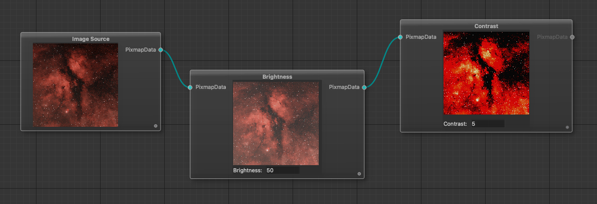

# 🌌 AstroFlow – Node-Based Astro Image Processing Editor

AstroFlow is a modern, modular image editor built on a node-graph architecture, designed specifically for astrophotography processing.
It implements interactive node-flow paradigm known from Unreal Engine.

The application allows you to build complex processing pipelines by intuitively connecting nodes within a 2D workspace.
Each operation — from loading an image, adjusting contrast and sharpness, to more advanced transformations — is represented as an independent node.



Any modification to any node triggers a full recomputation of all subsequent steps in the processing chain. This ensures that you always see results consistent with your entire editing history and allows you to adjust any step at any time.

## Experimental!

This project currently serves as a proof of concept. Contributions and pull requests that add new functionality are highly encouraged.

## Run with UV in terminal

### Option 1
```shell
    uv run --python 3.12 --with PyQt5,qtpynodeeditor src/main.py
```

### Option 2
```shell
    uv venv --python 3.12 .venv
    .\.venv\Scripts\activate
    uv pip install -r requirements.txt
    uv run src/main.py
```
